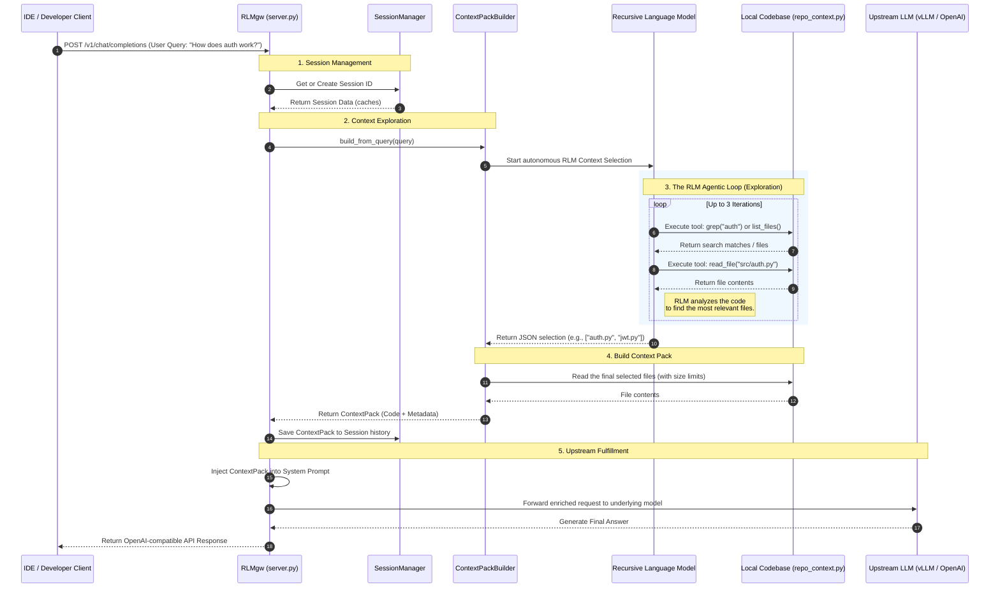

# RLMgw Architecture & Flow Diagram

The following Mermaid sequence diagram visualizes the end-to-end flow of how the Recursive Language Model Gateway (RLMgw) intercepts a user's prompt, autonomous explores the repository to gather context, and forwards the enriched context to the upstream Large Language Model.

You can view this diagram natively in IDEs like VS Code (using a Mermaid preview extension) or on GitHub.

## Key Phases Explained:
1. **Request Interception:** The IDE or developer talks to RLMgw mimicking a standard OpenAI endpoint.
2. **The Agentic Loop:** Instead of blindly passing the prompt, RLMgw spins up an RLM (agent) equipped with tools to read the local disk safely.
3. **Smart Context Pack:** The agent's structured JSON output specifies exactly which files matter. These files are aggregated into a "Context Pack" string.
4. **Enriched Fulfillment:** The upstream LLM is asked the User's original prompt *plus* the Context Pack, leading to a highly accurate resolution.
