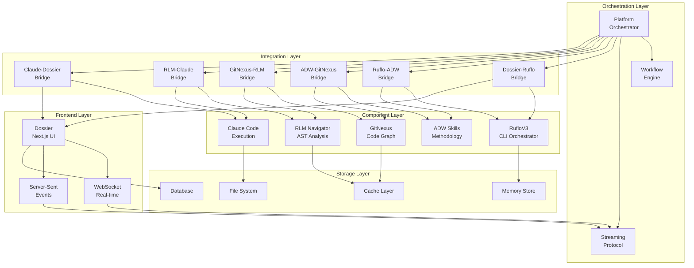
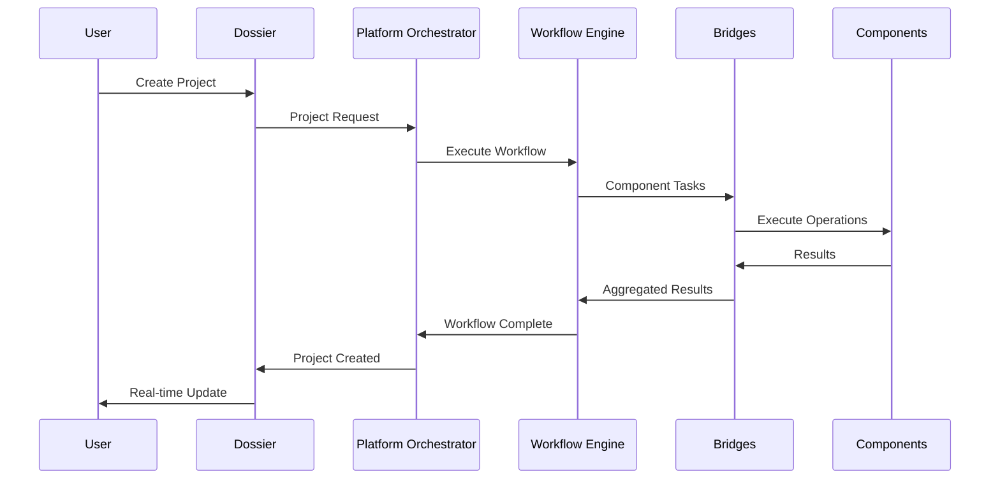
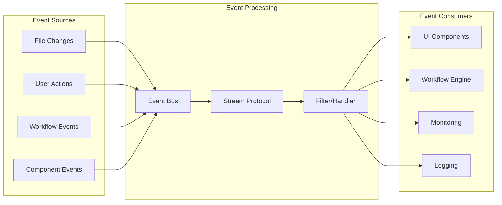

# Visión Maestra: Platform Architecture

## Overview

Visión Maestra is an autonomous development platform that integrates 6 core components into a unified development environment. This document describes the high-level architecture, component interactions, and design decisions.

## Architecture Principles

### 1. Component Integration
- **Loosely Coupled**: Components communicate through well-defined interfaces
- **Event-Driven**: Real-time communication via streaming protocols
- **Bridge Pattern**: Integration bridges handle component-specific communication
- **Fault Tolerant**: Individual component failures don't cascade

### 2. Scalability
- **Horizontal Scaling**: Components can scale independently
- **Load Balancing**: Intelligent routing based on component capabilities
- **Resource Management**: Dynamic resource allocation across components
- **Performance Monitoring**: Real-time metrics and optimization

### 3. Extensibility
- **Plugin Architecture**: New components can be added via bridges
- **Capability Discovery**: Runtime discovery of component capabilities
- **Configuration-Driven**: Behavior controlled via configuration files
- **API-First**: All interactions through standardized APIs

## Component Overview

### 1. Dossier (Frontend + Project Manager)
- **Technology**: Next.js, React, TypeScript
- **Role**: User interface and project management
- **Capabilities**:
  - Project creation and management
  - Real-time dashboard updates
  - User interaction handling
  - File system monitoring

### 2. RufloV3 (CLI Orchestrator)
- **Technology**: Node.js CLI, 15-agent mesh
- **Role**: Multi-agent coordination and execution
- **Capabilities**:
  - Swarm initialization and management
  - Agent spawning and coordination
  - Memory management (HNSW + Neural)
  - Task orchestration

### 3. ADW Skills (Methodology)
- **Technology**: Skill-based workflow system
- **Role**: Systematic development methodology
- **Capabilities**:
  - Specification workflow
  - Architecture design workflow
  - Implementation workflow
  - Quality assurance workflow

### 4. GitNexus (Code Graph Analysis)
- **Technology**: MCP server, Graph analysis
- **Role**: Repository structure analysis
- **Capabilities**:
  - Symbol relationship mapping
  - Dependency analysis
  - Impact assessment
  - Code navigation

### 5. RLM Navigator (AST Navigation)
- **Technology**: MCP server, AST parsing
- **Role**: Code-level navigation and analysis
- **Capabilities**:
  - Precise symbol location
  - Usage finding
  - Definition jumping
  - Refactoring support

### 6. Claude Code (Execution Engine)
- **Technology**: Current execution environment
- **Role**: Code execution and tool integration
- **Capabilities**:
  - File operations
  - Command execution
  - Code editing
  - Tool coordination

## System Architecture



## Data Flow Architecture

### 1. Request Flow


### 2. Event Flow


## Integration Patterns

### 1. Bridge Pattern Implementation

Each bridge implements the `ComponentBridge` interface:

```typescript
interface ComponentBridge {
  initialize(): Promise<void>;
  sendMessage(message: ComponentMessage): Promise<any>;
  checkHealth(): Promise<HealthMetrics>;
  getCapabilities(): ComponentCapability[];
  subscribe(eventType: string, callback: Function): void;
  shutdown(): Promise<void>;
}
```

### 2. Message Flow Pattern

```typescript
interface ComponentMessage {
  id: string;
  type: string;
  payload: any;
  metadata: {
    timestamp: Date;
    source: string;
    target?: string;
    priority: 'low' | 'normal' | 'high' | 'critical';
  };
}
```

### 3. Streaming Communication

- **WebSocket**: Real-time bidirectional communication
- **Server-Sent Events**: One-way streaming for updates
- **gRPC**: High-performance component-to-component communication

## Workflow Orchestration

### 1. Predefined Workflows

#### Full-Stack Development Workflow
```yaml
workflow:
  id: full-stack-development
  steps:
    - project-init (Dossier)
    - code-analysis (GitNexus)
    - setup-swarm (RufloV3)
    - parallel-development (RufloV3 + ADW + Claude)
    - integration-testing (All Components)
```

#### Code Refactoring Workflow
```yaml
workflow:
  id: code-refactoring
  steps:
    - impact-analysis (GitNexus + RLM)
    - create-plan (ADW Skills)
    - execute-refactoring (Claude Code)
    - verify-changes (GitNexus + RLM)
```

### 2. Dynamic Workflow Creation

Workflows can be created dynamically based on:
- User requests
- Component capabilities
- Project requirements
- Quality gates

## Configuration Management

### 1. Hierarchical Configuration
```
config/
├── platform/
│   ├── platform-config.ts      # Main platform configuration
│   └── environment-configs/     # Environment-specific overrides
├── components/
│   ├── dossier.json            # Dossier-specific config
│   ├── ruflo.json              # RufloV3-specific config
│   └── ...
└── workflows/
    ├── templates/               # Workflow templates
    └── instances/               # Active workflow configurations
```

### 2. Configuration Sources
1. **Default Configuration**: Built-in defaults
2. **File Configuration**: JSON/YAML files
3. **Environment Variables**: Runtime overrides
4. **Runtime Configuration**: Dynamic updates

## Security Architecture

### 1. Authentication & Authorization
- **Component Authentication**: API keys for component communication
- **User Authentication**: OAuth/LDAP integration
- **Role-Based Access**: Granular permissions
- **Session Management**: Secure session handling

### 2. Data Protection
- **Encryption in Transit**: TLS for all communication
- **Encryption at Rest**: Sensitive data encryption
- **Input Validation**: All inputs validated at boundaries
- **Audit Logging**: Complete audit trail

## Performance Considerations

### 1. Optimization Strategies
- **Caching**: Multi-level caching (L1: Memory, L2: Redis, L3: Database)
- **Connection Pooling**: Reuse of expensive connections
- **Lazy Loading**: Components loaded on demand
- **Resource Pooling**: Shared resources across components

### 2. Scaling Strategies
- **Horizontal Scaling**: Multiple instances of components
- **Vertical Scaling**: Resource allocation per component
- **Load Balancing**: Intelligent request distribution
- **Circuit Breakers**: Failure isolation

## Monitoring & Observability

### 1. Metrics Collection
- **System Metrics**: CPU, Memory, Network, Disk
- **Application Metrics**: Request rates, response times, errors
- **Business Metrics**: Project completions, workflow success rates
- **Custom Metrics**: Component-specific measurements

### 2. Health Monitoring
```typescript
interface HealthMetrics {
  uptime: number;
  responseTime: number;
  errorRate: number;
  memoryUsage: number;
  cpuUsage: number;
}
```

### 3. Alerting System
- **Threshold-based**: Alerts when metrics exceed thresholds
- **Anomaly Detection**: ML-based anomaly detection
- **Escalation**: Multi-level alert escalation
- **Integration**: Slack, email, webhook notifications

## Deployment Architecture

### 1. Component Deployment
```yaml
deployment:
  platform-orchestrator:
    replicas: 1
    resources: { memory: "1Gi", cpu: "500m" }

  streaming-protocol:
    replicas: 2
    resources: { memory: "512Mi", cpu: "250m" }

  bridges:
    replicas: 1
    resources: { memory: "256Mi", cpu: "100m" }
```

### 2. Infrastructure Requirements
- **Minimum**: 4 CPU cores, 8GB RAM, 100GB storage
- **Recommended**: 8 CPU cores, 16GB RAM, 500GB storage
- **Network**: Low latency internal communication
- **Storage**: SSD for performance-critical operations

## Future Architecture Considerations

### 1. Microservices Evolution
- **Service Mesh**: Istio/Linkerd for service communication
- **Container Orchestration**: Kubernetes deployment
- **API Gateway**: Centralized API management
- **Service Discovery**: Automatic service registration

### 2. Cloud-Native Features
- **Auto-scaling**: Kubernetes HPA/VPA
- **Multi-cloud**: Deployment across cloud providers
- **Serverless**: Function-as-a-Service for specific components
- **Edge Computing**: Edge deployment for low-latency access

### 3. AI/ML Integration
- **Model Serving**: Dedicated model serving infrastructure
- **Feature Store**: Centralized feature management
- **Experiment Tracking**: A/B testing and experimentation
- **AutoML**: Automated model training and optimization

## Conclusion

The Visión Maestra platform architecture provides:

1. **Unified Development Environment**: All tools integrated seamlessly
2. **Scalable Foundation**: Can grow with increasing demands
3. **Extensible Design**: New components can be added easily
4. **Robust Operation**: Fault-tolerant and self-healing
5. **Developer Experience**: Intuitive and powerful interface

This architecture enables autonomous development workflows while maintaining flexibility and control for developers.